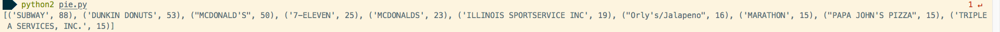
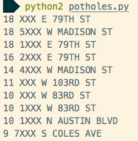
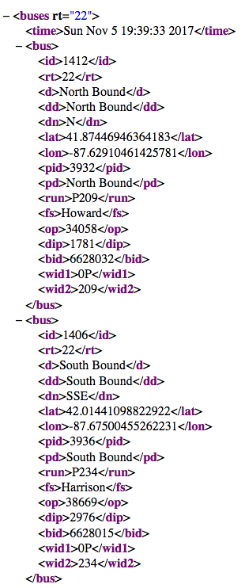

Learn-Python-Through-Public-Data-Hacking
========================================

## Introduction

A fantastic hands-on Python course taught by David Beazley. All of the source code and source files can be found here.

The video and supporting material can be found at [David's website](http://www.dabeaz.com/pydata/).

## Description

The applications in this repository can:
* Query the Chicago Public transit API to get all current bus locations
* Show any stops busses on Route 22 are making in real-time
* Shows which streets have the most and fewest potholes by city block
* Shows which restaurants have the most health violations
* Many other cool exercises!

## Screenshots

### Show the restaraunts in Chicago with the most health violations

### Show which blocks of which streets have the most potholes

### Real-time location data from the Chicago Public Transit (bus) API

